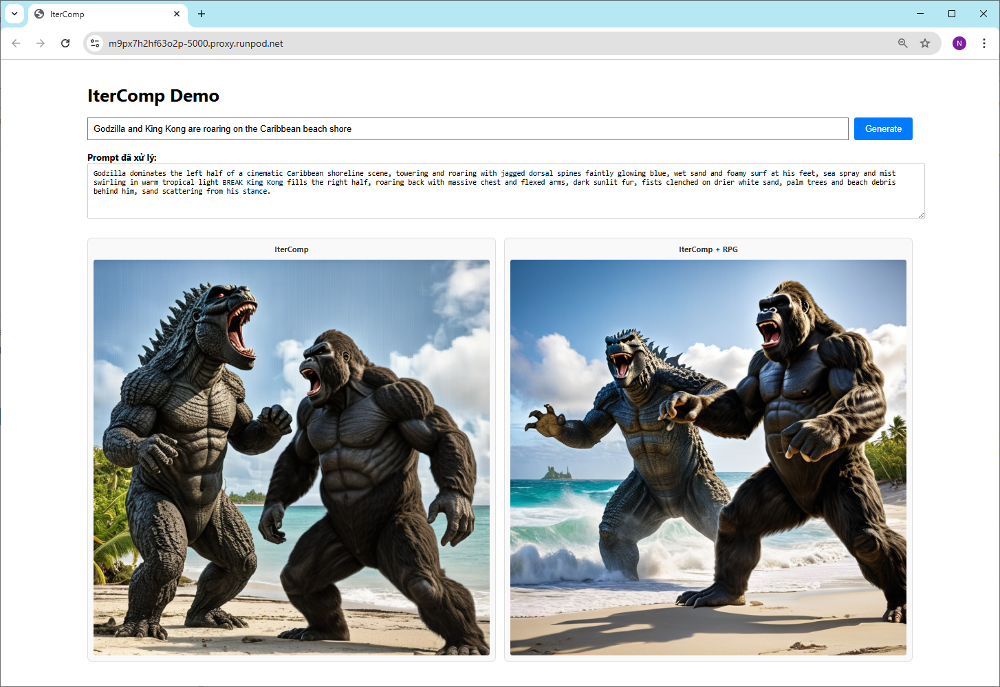

# IterComp DEMO

## Step 1: setup
python = 3.9   !important, version python khác chưa được test

#### Option 1: tự cài từ file requirements
```pip install -r requirements.txt```

#### Option 2: download folder cài sẵn (~10GB)
- download file và giải nén

- dùng miniconda/anaconda kích hoạt thư mục vừa giải nén
```conda activate /path/to/your/custom/folder```

## Step 2: Test môi trường
- kích hoạt môi trường ở step 1
- chạy file test.py
- nếu môi trường, kết nối tới huggingface (download model, chỉ download vào lần chạy đầu tiên) và gpt không có vấn đề sẽ sinh ra file 'test.png'

## Step 3: Chạy demo
- Có 2 thí nghiệm, so sánh IterComp với 2 model phổ biến khác, và thí nghiệm so sánh Itercomp thuần tuý với tăng cường bằng RPG
- 3 model trong demo là SDXL-Turbo, Playground v2, IterComp

#### Option 1: 3 model (SDXL-Turbo, Playground v2, IterComp)
do số lượng model lớn nên khi nhận được request mới bắt đầu load model vào memory, do đó thời gian phải hồi dài, nhất là lần chạy đầu tiên phải download model từ huggingface.

```uvicorn webapp-3model:app --host 0.0.0.0 --port 5000```


#### Option 2: 1+1 model (IterComp)
đang load cả 2 model vào memory ngay khi khởi động webapp nên thời gian phản hồi khi nhận được request tốt hơn bản ở trên rất nhiều.

```uvicorn webapp-1model:app --host 0.0.0.0 --port 5000```
